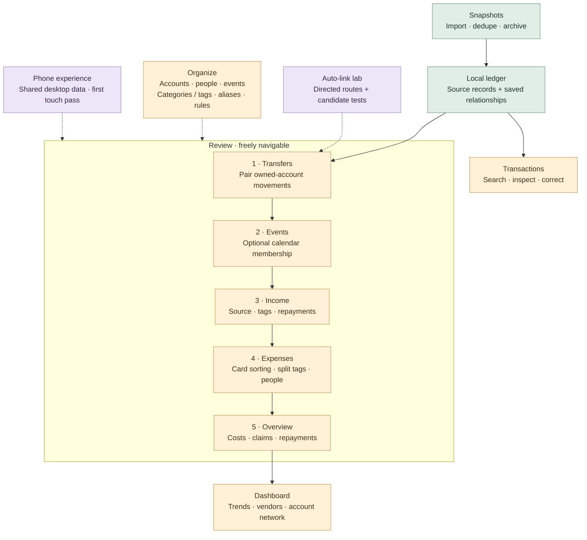

# Urbanomics experience map

Updated September 13, 2026. This is a product/design checkpoint, not a new implementation specification.

## Reading on a phone

The user is currently reviewing from mobile. Provide browser links for supporting diagrams and notes rather than relying on local-file links or diagrams embedded only in chat.

`npm run docs:serve` starts the mobile reading page on port 4176 at the desktop Tailscale address. It uses the existing private remote-access configuration and personal peer authorization. The notebook is a separate read-only process: it needs the desktop awake and Tailscale connected, but does not restart Electron, open the ledger or expose directories. Restart it with the same command after a reboot. `URBANOMICS_NOTEBOOK_PORT` can select another available port.

The page renders a vertical, phone-readable version of the product diagram, expandable section notes and the sorting trial. It includes the original Mermaid source and downloadable full notes. Its section descriptions are generated from the table below; it is a dated design checkpoint, not live project telemetry.

## Current direction

The core finance loop is implemented. The next useful commitment is focused interaction refinement, beginning with expense card sorting, while testing phone interactions alongside desktop. The user likes playful, tactile sorting but reports jankiness. That supports retaining and refining the concept; it does not establish the cause of the friction.

Progress below separates implemented behavior from a settled user experience. Functional tests can establish saving, navigation and accounting invariants. They cannot establish that a gesture feels fluid or that the information hierarchy is understandable.

## Product map

Solid arrows show the usual journey, not completion gates. Dotted arrows show supporting relationships. Green is an implemented foundation, amber is implemented with interaction refinement open, and purple is experimental or awaiting device feedback. No color means “finished.”

## What is mapped, and what remains open

| Area | Established and implemented | Experience questions still open |
| --- | --- | --- |
| Snapshots | Account routing, repeat-import dedupe, monthly snapshots, immutable originals, archive/history, account colors. | Is automatic processing versus staged processing obvious? How easily can the user resolve an unknown file or ambiguous duplicate and understand the result? |
| Transfers | Separate system lens; linked principal leaves income/expense totals and tag queues; explicit Link, Undo, filters, discrepancies and linked history. | Does choosing a pair make direction and fees immediately clear? Is correcting a wrong pair easy? Which lab suggestions merit eventual automation? |
| Events | Optional whole-transaction membership, dated events, calendar selection, event costs and repayments. | How efficient is selecting many days/transactions? Are suggested date matches distinguishable from saved membership? Is leaving an item outside every event obviously valid? |
| Income | Independent income tags, source/purpose, bank and manual cash receipts, allocations to unique expenses with event shortcuts, visible unallocated remainder. | Can the user distinguish tagging a receipt, allocating it, identifying its payer and changing an agreed share? How quickly can unrelated expenses be found and split? |
| Expenses | Category-to-tag hierarchy; desktop radial; phone category/tag buttons; split-tag editor; people/shares; first assignment advances and edits stay. | Gesture continuity, opening/closing boundaries, target stability, save/advance feedback, recovery and split-editor interruption. This is the first focused refinement candidate. |
| Overview / Dashboard | Boundary cash flow, internal transfers separated, gross/repaid/still-paid costs, claims, monthly trends, category/tag/vendor drilldowns and account network. | Which few answers deserve prominence? Does the user understand the difference between cash movement, their share and unpaid repayments? Does drilldown preserve useful context? |
| Organize | Categories and manually ordered tags, palettes, people/events/accounts, global aliases, alias-or-regex rules, previews/conflicts and confirmed maintenance. | How efficient is repetitive cleanup? Is moving versus ordering a tag clear? Can a user predict what a rule will change and what it will leave alone? |
| Transactions | Search, fact-based filters, source inspection and financial editing without a generic reviewed flag. | Is this the obvious place to find and correct an exception? Do filters and returns from other sections preserve context? |
| Mobile | Shared live desktop service, Tailscale access, responsive panels, tap sorting and concurrent-edit protection. | Actual phone connection and user comfort still need confirmation. Navigation, keyboard-open forms, thumb reach and interruptions need hands-on evaluation. |

The right-hand column contains proposed learning questions, not confirmed defects or approved additions.

## Explicitly incomplete or outside the current implementation

- Bank export/download automation has not been built. Imports currently start with files; Wealthsimple does not yet have a supported adapter.
- Snapshot presence does not prove complete month coverage. Observed exported balances are not a full current-balance reconciliation system.
- Auto-link remains a testing lab with explicit application, not automatic linking during import.
- Private recovery copies exist, but a general user-facing backup/restore workflow is not established.
- The phone UI is a first pass. Offline editing and home-screen installation are outside that iteration; the route-network lab still uses a large canvas.

These are boundaries, not a proposal to pursue all of them now. Budgeting, investment tracking and other possible finance features are not counted as missing requirements.

## First focus: the card-sorting interaction

Keep the accepted finance semantics: no target paging; category then tag; leaving the expanded circle closes it; first successful tagging advances; edits/removals remain on the viewed transaction; cancelled or failed saves do not advance. Keep exact-cent splits and the alternate editor.

```mermaid
stateDiagram-v2
    [*] --> Ready
    Ready --> Dragging: Pick up and move card
    Dragging --> TagsOpen: Enter a category
    TagsOpen --> Dragging: Leave the expanded circle
    TagsOpen --> Saving: Release on a tag
    Dragging --> Ready: Cancel or release elsewhere
    TagsOpen --> Ready: Cancel
    Ready --> Editor: Click or tap card
    Editor --> Ready: Cancel
    Editor --> Saving: Save
    Saving --> NextCard: Successful first assignment
    Saving --> Ready: Successful change to a saved card
    Saving --> Retry: Save fails; retain context
    Retry --> Saving: Retry
    NextCard --> Ready
```

This diagram is the intended interaction contract. It is not a claim that every visual transition already communicates these states well. Direct tag clicks and the mobile button path invoke the same save semantics without requiring dragging.

### Evidence and hypotheses

Source inspection finds immediate category expansion on hover/focus, document-level pointer boundary closing, captured-card hit testing and edge scrolling. On release, the card transform resets before the asynchronous save finishes. These are concrete places to observe for abrupt transitions; this inspection does not prove which causes the reported jank.

The phone stylesheet currently hides the sorter's local status area. That is a specific feedback difference to evaluate alongside desktop, not evidence that all application errors are hidden.

### Bounded next trial

Use one isolated sorting playground with synthetic transactions and the current implementation as the baseline. Exercise a small category and a crowded category, first tagging, correcting a saved card, cancellation, a two-tag split, and a delayed/failed save. Repeat the equivalent tasks with phone taps. Use realistic animation and persistence timing: a static mockup cannot answer the fluidity question.

First observe where the gesture breaks. Then change only the implicated transition: for example, coordinate target reveal with hit testing, or provide a continuous card-to-target-to-next-card transition after a successful save. Do not introduce hover delays or redesign the whole radial merely because they seem likely to help.

Observe accidental assignments, unintended collapses, corrective backtracking, surprise navigation and whether saving/failed saving is clear. Ask for the user's reaction to feel and effort. Compare with the same tasks and comparable polish. A smoother short trial supports that iteration; it does not establish long-session comfort. If the gesture still requires careful steering, compare a deliberate category selection with stable tag targets before adding more animation.

## Focus sequence

1. Expense sorting: gesture, save feedback, navigation and correction.
2. Income and shared costs: allocation, shares, repayments and remaining amounts.
3. Transfers and Events: pairing/correction and optional bulk membership.
4. Overview and Dashboard: useful answers and understandable drilldowns.
5. Organize and Snapshots: efficient repeated cleanup and exception handling.

Test the phone equivalent during each focus area. This sequence is a recommendation pending the user's reaction, not a requirement to finish every area before further use.

## Evidence sources

- Current user request and prior accepted interaction decisions.
- `review-workflow.md`, `tag-hierarchy.md`, `desktop-review.md`, `desktop-imports.md`, `transaction-aliases.md`, `transaction-rules.md`, `transfer-lab.md`, `dashboard.md`, `mobile-remote.md`.
- `src/OrbitSorter.jsx`, `src/RadialHierarchy.jsx`, `src/mobile.css` for the focused sorting inspection.
- Existing synthetic desktop, mobile and accounting verification documents functional coverage. No new live interaction test was run for this map; no private financial records were changed.

Historical direction notes describe superseded designs. Current hierarchy, manual tag order and the Transfers → Events → Income → Expenses → Overview flow take precedence.
